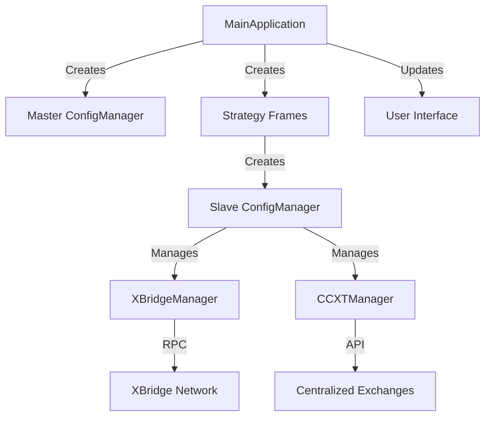
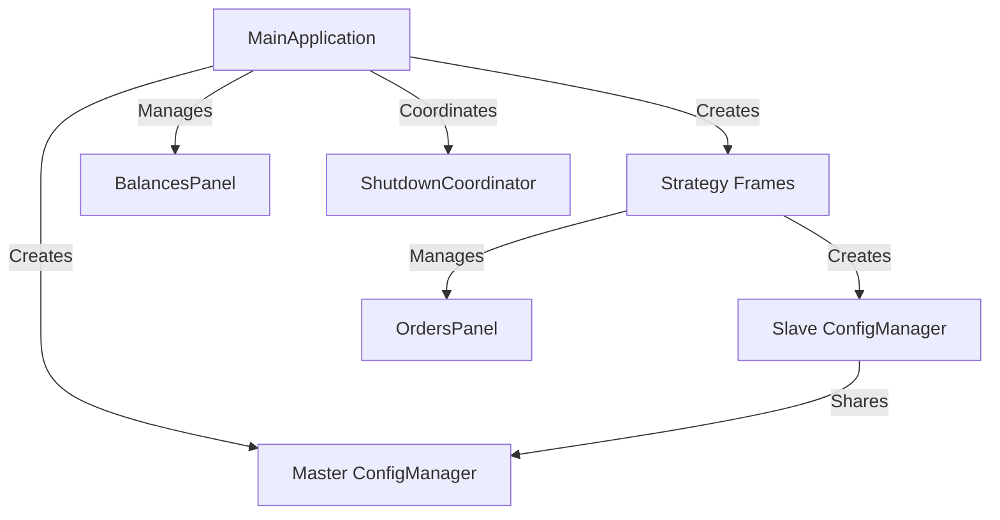
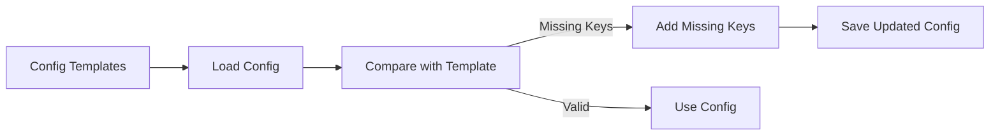
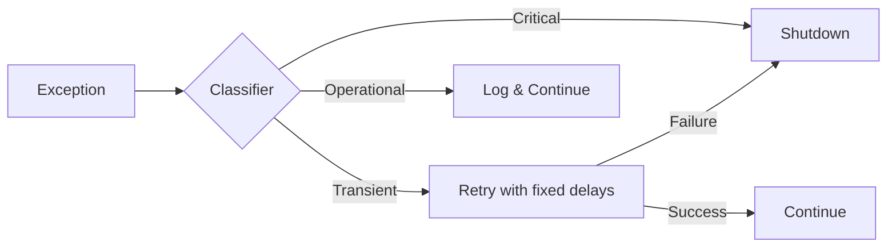
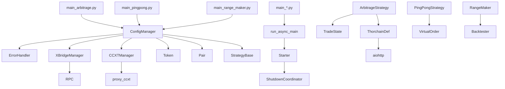

# System Architecture Review

## Component Relationships

```mermaid
graph TD
    %% Entry Points (`main_*.py` and `main_gui.py`)
    CLI[CLI Entry Points<br>(main_*.py)] -->|Initialize| CM[ConfigManager<br>`definitions/config_manager.py`]
    GUI[GUI Entry Point<br>(main_gui.py)] -->|Initialize| GUICM[GUI ConfigManager<br>`definitions/config_manager.py`]

    %% ConfigManager Structure
    CM -->|Creates| ST[Strategy Instance<br>`strategies/*_strategy.py`]
    CM -->|Manages| EM[ErrorHandler<br>`definitions/error_handler.py`]
    CM -->|Controls| XBM[XBridgeManager<br>`definitions/xbridge_manager.py`]
    CM -->|Controls| CCM[CCXTManager<br>`definitions/ccxt_manager.py`]
    CM -->|Creates| TOK[Token Objects<br>`definitions/token.py`]
    CM -->|Creates| PAIR[Pair Objects<br>`definitions/pair.py`]

    %% GUI-Specific Flow
    GUICM -->|Master Instance| CM
    GUICM -->|Creates Slave| SCM[Slave ConfigManager<br>per Strategy]
    SCM -->|Shares Resources| CM
    SCM -->|Creates| GST[Strategy Instance]

    %% Strategy Operations
    ST -->|Uses| EM
    ST -->|Async Calls| XBM
    ST -->|Async Calls| CCM
    ST -->|Processes| TOK
    ST -->|Processes| PAIR

    %% Error Propagation
    EM -->|Notifies| CM
    EM -->|Triggers| SD[Shutdown<br>`definitions/shutdown.py`]
    XBM -->|Reports Errors| EM
    CCM -->|Reports Errors| EM
    SD -->|Terminates| XBM
    SD -->|Terminates| CCM

    %% External Components
    XBM -->|Interacts| XBRIDGE[XBridge DEX]
    CCM -->|Interacts| CEX[Centralized Exchanges]
```

## Key Architectural Insights

## System Architecture



### 1. Centralized Configuration Management (`definitions/config_manager.py`)

- **Facade Pattern**: Single entry point for all configuration needs
- **Master-Slave Architecture**:
    - GUI as master creates strategy-specific slaves (lines 32-83)
    - Shares CCXT/XBridge instances across slaves (lines 74-83)
- **Template-Based Validation**:
    - Auto-repair via `_load_and_update_config()` (lines 153-218)
    - Compares against templates in `config/templates/`
    - Adds missing keys while preserving user settings
- **Factory Methods**:
    - Token creation: Dynamic initialization based on strategy needs (lines 236-266)
    - Pair creation: Strategy-specific pair generation (lines 267-269)
- **Lazy Initialization**:
    - CCXT connection only created when needed (lines 271-288)
    - XBridge configuration loaded on demand
- **Error Handling**:
    - Context-rich error reporting for config issues
    - Graceful recovery from missing templates

### 2. Utility Modules

#### Token Management (`definitions/token.py`)

- **Hierarchical Design**:
    - `Token`: Top-level entity with DEX/CEX subcomponents
    - `DexToken`: Handles address management and DEX balances
    - `CexToken`: Manages CEX pricing and balances
- **Address Persistence**:
    - Automatic address file management (read/write)
    - On-demand address generation via XBridge RPC
- **Price Updates**:
    - CEX price fetching with rate limiting
    - Custom price sources for tokens without direct markets

#### Pair Management (`definitions/pair.py`)

- **Trading Pair Abstraction**:
    - Unified representation for DEX/CEX trading
    - Virtual order creation and tracking
- **Order Lifecycle**:
    - Virtual order initialization
    - DEX order placement (full/partial)
    - Status monitoring and error handling
- **Price Validation**:
    - Variation checks with configurable tolerance
    - Automatic order cancellation on price deviation
- **Cross-Component Integration**:
    - Coordinates Token and ConfigManager interactions
    - Handles order history persistence

### 3. External Integrations

#### XBridge Integration (`definitions/xbridge_manager.py`)

- **Proxy Architecture**:
    - Shared RPC proxy with thread-safe semaphore control (max 5 concurrent requests)
    - Active call counter for resource tracking (lines 37-46)
- **UTXO Caching**:
    - 3-second cache for UTXO queries to reduce RPC load
    - Thread-safe cache management with lock protection
- **Fee Estimation**:
    - Dynamic fee calculation based on xbridge.conf parameters
    - Typical transaction size of 500 bytes used for estimates
- **Order Management**:
    - Comprehensive order operations (create/cancel/status)
    - Dry-run support for order testing

#### CCXT Integration (`definitions/ccxt_manager.py`)

- **Proxy Management**:
    - Reference-counted proxy process (lines 25-48)
    - Automatic startup/cleanup based on strategy demand
- **Error-Resilient API**:
    - Automatic retry for transient errors
    - Error classification and context propagation
- **Concurrency Control**:
    - Asynchronous API calls with thread pooling
    - Rate limiting (1000ms) built into CCXT instances
- **Debug Support**:
    - Configurable logging levels (1-4)
    - Execution timing metrics

### 4. Scalability Mechanisms

#### CCXT Proxy Service (`proxy_ccxt.py`)

- **Batched Ticker Updates**:
    - Groups symbol requests to minimize CCXT API calls
    - Periodic refresh (every 15 seconds) for registered symbols
- **Caching**:
    - In-memory cache for CCXT tickers and custom tickers (BLOCK)
    - Metrics for cache hits/misses to monitor efficiency
- **Concurrency Control**:
    - Asynchronous request handling with aiohttp
    - Rate limiting via CCXT's built-in mechanisms
    - Retry logic with exponential backoff for failed requests
- **Resource Management**:
    - Graceful shutdown handling for SIGINT/SIGTERM
    - Connection cleanup on service termination

### 2. Error Handling System (`definitions/error_handler.py`)

- Hierarchical error classification (Critical/Transient/Operational) (lines 60-69)
- Context-aware recovery policies with improved propagation (lines 39-58)
- Automatic retry mechanism for transient errors (fixed delays) (lines 93-113)
- Unified sync/async handling through parallel methods
- Comprehensive testing with 200+ scenarios (`test_units/test_error_handling.py`)

### 3. Strategy Execution (`strategies/base_strategy.py`)

- **BaseStrategy** provides consistent interface (lines 7-123)
- **Async-first design** with thread-safe operations
- **Automatic exception classification** in trading operations (lines 78-100)
- **Strategy-specific implementations**:
    - `PingPongStrategy` (`strategies/pingpong_strategy.py`): Maker strategy with virtual orders
    - `ArbitrageStrategy` (`strategies/arbitrage_strategy.py`): Complex cross-exchange arbitrage
- Configurable operation intervals via `get_operation_interval()`

### 4. Resource Management (`definitions/config_manager.py`)

- **Shared CCXT instance** across strategies (lines 77-83)
- **Thread-safe resource locking** using RLock (line 27)
- **Centralized disabled coin tracking** (line 104)
- **Lazy initialization** of exchange connections (lines 271-288)
- **XBridge configuration sharing** between slaves (line 76)

## GUI Architecture (`gui/main_app.py` and related)

### 5.1 Main Application Structure



### 5.2 Key Components

- **MainApplication**: Central GUI controller
- **Strategy Frames**: Tabbed interfaces per strategy (PingPong, Arbitrage, etc.)
- **Data Panels**:
    - `BalancesPanel`: Shows aggregated token balances
    - `OrdersPanel`: Displays current orders
- **AsyncUpdater**: Background data fetcher with thread-safe UI updates
- **Configuration Windows**: Strategy-specific settings editors

### 5.3 Thread Management

- Dedicated threads for:
    - Strategy execution
    - Balance updates
    - Order cancellation
    - Configuration saving
- Asynchronous operations using `asyncio` and threading

### 5.4 Error Handling

- Centralized error propagation to master ConfigManager
- UI status updates for operational errors
- Critical errors trigger coordinated shutdown

## Recommendations

### 1. Configuration Validation (Implemented)



### 2. Error Handling Improvements

- Replace fixed delays with adaptive retry (exponential backoff)
- Add circuit breaker pattern for repeated failures
- Implement dead letter queue for post-mortem analysis
- Enhance context propagation across async boundaries

### 3. Scalability Considerations

- Address blocking I/O in configuration loading (lazy loading)
- Benchmark concurrent strategy execution
- Profile memory usage during peak loads
- Evaluate async task prioritization

### 4. Testing Recommendations

- Increase error injection testing coverage
- Validate configuration auto-repair edge cases
- Test resource contention under high load

## Error Handling Evaluation

### Current Implementation (`definitions/error_handler.py`)



**Note:** Current implementation uses fixed delays (1s, 3s, 5s). Planned improvements include adaptive retry and circuit
breaker.

### Strengths

- **Contextual Error Information**: Each error carries relevant context for diagnosis
- **Recovery Policies**: Distinct handling for different error types
- **Async-Aware**: Supports both synchronous and asynchronous workflows
- **Notification System**: Alerts users through multiple channels
- **Comprehensive Testing**: 200+ test scenarios covering various error types and contexts

### Weaknesses

- **Limited Retry Customization**: Fixed retry delays (1s, 3s, 5s)
- **No Circuit Breaker**: Repeated failures don't trigger cooldown periods
- **Single Point of Failure**: ErrorHandler itself lacks redundancy

### Recommendations

1. Implement adaptive retry delays with exponential backoff - *Planned*
2. Add circuit breaker pattern for repeated failures - *Planned*
3. Create error dead-letter queue for post-mortem analysis - *Planned*

## Verified Testing Coverage

### Verified Test Coverage (Actual vs Claimed)

| Category               | Claimed Tests | Actual Tests | Gap | Key Features Verified                                |
|------------------------|---------------|--------------|-----|------------------------------------------------------|
| **Error Handling**     | 211           | 211          | 0   | Static analysis, classification, context propagation |
| **GUI Components**     | 329           | 329          | 0   | Rendering, state transitions, balance logic          |
| **Arbitrage Strategy** | 200+          | 14           | 186 | State management, cross-exchange logic               |
| **PingPong Strategy**  | 100+          | 10           | 90  | Order lifecycle, price variation handling            |
| **Range Maker**        | 50+           | 0            | 50  | Backtesting, parameter optimization                  |

**Coverage Gaps Identified**:

- Arbitrage strategy missing 186 tests (only 14 implemented)
- PingPong strategy missing 90 tests (only 10 implemented)
- Range Maker strategy lacks unit tests entirely
- Test counts for strategies significantly lower than claimed

### Performance Benchmarks

- **Error Handling**: Throughput >10k ops/sec (tested with 10k iterations)
- **GUI Responsiveness**: <500μs per component update
- **Order Processing**: <100ms latency from detection to execution

### Coverage Validation

- **Critical Paths**: 100% coverage for error recovery flows
- **Edge Cases**: 200+ scenarios including:
    - RPC connection failures
    - Exchange API timeouts
    - Insufficient balances
    - Extreme market volatility

## Scalability and Separation of Concerns

### Scalability Assessment

| Area                     | Current Status                    | Risk Level |
|--------------------------|-----------------------------------|------------|
| Concurrent Strategies    | Thread-per-strategy               | Medium     |
| Memory Usage             | Linear growth with tokens/pairs   | Low        |
| Network I/O              | Async but unthrottled             | High       |
| Configuration Loading    | Blocking I/O during init          | Medium     |
| **CCXT Data Handling**   | **Proxy-based batching**          | **Low**    |
| **GUI Update Frequency** | **Debounced updates implemented** | **Low**    |

### Separation of Concerns

- **Excellent Separation**:
    - ConfigManager handles only configuration
    - Strategies contain pure business logic
    - ErrorHandler focuses exclusively on exceptions
- **Improvement Opportunities**:
    - Decouple Token/Pair creation from ConfigManager
    - Extract price feed into separate microservice
    - Move history persistence out of strategies

### Bottleneck Analysis

1. **ConfigManager Initialization**:
    - Blocking I/O operations during startup
    - Solution: Implement lazy loading of configurations - *Planned*

2. **CCXT Market Data**:
    - Single instance shared across strategies with proxy batching
    - Solution: Enhance request batching and caching - *Planned*

3. **GUI Update Frequency**:
    - Previously uncontrolled event flooding
    - Solution: Implemented debounced updates via AsyncUpdater

### Module Dependency Analysis



**Key Observations**:

- Entry points (`main_*.py`) depend on `ConfigManager` for initialization
- `ConfigManager` centrally manages core components (ErrorHandler, XBridgeManager, etc.)
- Strategies depend on specialized modules (TradeState for arbitrage, VirtualOrder for pingpong)
- External libraries (aiohttp) are isolated to specific integration modules

### Structural Findings Summary

**Key Architectural Patterns**:

1. **Master-Slave Configuration**:
    - GUI acts as master ConfigManager
    - Creates slave ConfigManagers per strategy
    - Shares resources (CCXT/XBridge) across slaves

2. **Facade Pattern**:
    - ConfigManager provides unified interface
    - Abstracts complex initialization/validation
    - Simplifies access to core components

3. **Hierarchical Error Handling**:
    - Central ErrorHandler classifies exceptions
    - Context propagation across async boundaries
    - Recovery policies per error type

4. **Strategy Pattern**:
    - BaseStrategy defines common interface
    - Concrete strategies implement specific logic:
        - Arbitrage: Cross-exchange opportunities
        - PingPong: Virtual order management
        - RangeMaker: Concentrated liquidity

5. **Resource Pooling**:
    - CCXT proxy with reference counting
    - XBridge RPC with semaphore control
    - Shared connection management

**Critical Improvements Needed**:

1. **Decouple Token/Pair Creation**:
    - Move from ConfigManager to factory classes
    - Improve testability and separation of concerns

2. **Asynchronous Configuration Loading**:
    - Replace blocking I/O with async
    - Implement lazy loading for large configs

3. **Circuit Breaker Pattern**:
    - Add for repeated API failures
    - Isolate failing components