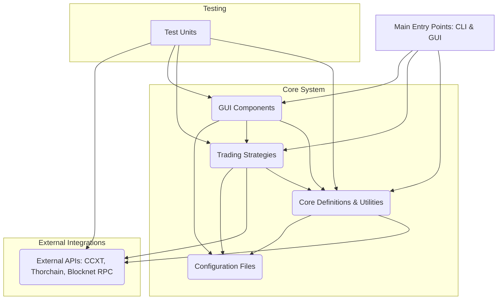

# Comprehensive Codebase Overview: XBridge Trading Bots

The XBridge Trading Bots project is a Python-based application designed for automated cryptocurrency trading, primarily focusing on decentralized exchange (DEX) operations via XBridge and cross-chain swaps via Thorchain, alongside integration with centralized exchanges (CEX) via CCXT for pricing and balance information. It features both command-line interface (CLI) and a graphical user interface (GUI) modes, supporting various trading strategies.

## 1. High-Level Architecture:

The application follows a modular and layered architecture, separating core functionalities, trading strategies, and user interfaces.

## 2. Core Modules and Their Responsibilities:

*   **`definitions/`**: This directory houses the fundamental building blocks and common utilities.
    *   **[`config_manager.py`](definitions/config_manager.py)**: The central configuration hub. It loads, manages, and updates application settings from YAML files and templates. It acts as a **Facade** for configuration access and a **Factory** for `Token` and `Pair` objects. It also orchestrates logger setup and resource sharing (e.g., `CCXTManager`, `XBridgeManager`) between GUI (master) and strategy (slave) instances.
    *   **[`ccxt_manager.py`](definitions/ccxt_manager.py)**: Handles all interactions with centralized exchanges using the `CCXT` library. It manages API keys, fetches market data (order books, tickers, balances), implements error handling with retry logic, and can start/manage a shared CCXT proxy. It uses a **Singleton** for the proxy process and a **Wrapper** for CCXT calls.
    *   **[`xbridge_manager.py`](definitions/xbridge_manager.py)**: Manages communication with the XBridge DEX via RPC calls to the Blocknet core wallet. It provides functionalities for order management (creation, cancellation, status), balance queries, UTXO caching, and parsing `xbridge.conf` for fee estimation. It employs a **Wrapper** for RPC calls and uses a **Thread Pool** for executing blocking RPC operations asynchronously.
    *   **[`pair.py`](definitions/pair.py)**: Defines `Pair`, `DexPair`, and `CexPair` classes. `Pair` aggregates DEX and CEX-specific logic for a trading pair. `DexPair` handles XBridge order creation, status checks, and history. `CexPair` manages CEX pricing and order book data. This module heavily utilizes the **Strategy Pattern** by delegating specific trading logic to the `strategy_instance`.
    *   **[`token.py`](definitions/token.py)**: Defines `Token`, `DexToken`, and `CexToken` classes. `Token` represents a cryptocurrency, aggregating `DexToken` (DEX address/balance) and `CexToken` (CEX price/balance). It handles address persistence and CEX price fetching. It uses a **Composite Pattern**.
    *   **[`logger.py`](definitions/logger.py)**: Centralized logging setup, providing colored console output and file logging.
    *   **[`rpc.py`](definitions/rpc.py)**: Generic RPC call utility, used by `CCXTManager` and `XBridgeManager`.
    *   **[`shutdown.py`](definitions/shutdown.py)**: Provides `ShutdownCoordinator` for orchestrating graceful application shutdown.
    *   **[`starter.py`](definitions/starter.py)**: Contains `MainController` and `run_async_main`, which are responsible for initializing and running the main asynchronous loop for trading bots, including managing concurrency with semaphores.
    *   **[`trade_state.py`](definitions/trade_state.py)**: Manages the persistence and recovery of trade states, particularly for the Arbitrage strategy. Implements an implicit **State Pattern**.
    *   **[`thorchain_def.py`](definitions/thorchain_def.py)**: Provides functions for interacting with the Thorchain API (quotes, inbound addresses, swap execution, transaction status).
    *   **[`yaml_mix.py`](definitions/yaml_mix.py)**: Utility for loading YAML files into object-like structures.

## 3. Trading Strategies (`strategies/`):

The strategies are built upon an extensible framework using the **Strategy Pattern**.
*   **[`base_strategy.py`](strategies/base_strategy.py)**: Abstract base class defining the common interface for all trading strategies.
*   **[`maker_strategy.py`](strategies/maker_strategy.py)**: Abstract class extending `BaseStrategy` for "maker" bots (those placing orders on the DEX). It provides common file path logic and abstract methods for order building and price calculation.
*   **[`arbitrage_strategy.py`](strategies/arbitrage_strategy.py)**: (Inherits from `BaseStrategy`) Implements cross-exchange arbitrage between XBridge and Thorchain. Features robust state management for trade resumption and a pause mechanism.
*   **[`basicseller_strategy.py`](strategies/basicseller_strategy.py)**: (Inherits from `MakerStrategy`) A simple strategy for selling a specified amount of a token at or above a minimum USD price.
*   **[`pingpong_strategy.py`](strategies/pingpong_strategy.py)**: (Inherits from `MakerStrategy`) Implements a buy-sell alternation strategy, with logic to "lock" buy prices to prevent buying higher than the last sell.
*   **[`range_maker_strategy.py`](strategies/range_maker_strategy.py)**: (Inherits from `BaseStrategy`) A more advanced market-making strategy that places orders within a defined price range, potentially with concentrated liquidity.

## 4. GUI Components (`gui/`):

The GUI is built using `tkinter` and `ttkbootstrap` for styling, following a modular design.
*   **[`main_app.py`](gui/main_app.py)**: The main GUI application window, hosting strategy tabs and a shared balances panel. It manages the overall GUI lifecycle and shutdown.
*   **`frames/` (`base_frames.py`, `strategy_frames.py`):**
    *   [`BaseStrategyFrame`](gui/frames/base_frames.py): Abstract base for individual strategy tabs, managing bot lifecycle (start/stop), thread management, and common buttons.
    *   [`StandardStrategyFrame`](gui/frames/base_frames.py): Extends `BaseStrategyFrame` for strategies with common UI elements like an orders panel.
    *   [`strategy_frames.py`](gui/frames/strategy_frames.py): Concrete implementations for `PingPongFrame`, `BasicSellerFrame`, and `ArbitrageFrame`.
*   **`components/` (`data_panels.py`, `dialogs.py`, `logging_components.py`):**
    *   [`data_panels.py`](gui/components/data_panels.py): Reusable `BaseDataPanel` for tabular data display (`OrdersPanel`, `BalancesPanel`), featuring thread-safe updates and sorting.
    *   [`dialogs.py`](gui/components/dialogs.py): Hierarchy of dialogs for input validation and configuration management.
    *   [`logging_components.py`](gui/components/logging_components.py): GUI-specific logging (displaying logs in a text widget, redirecting stdout/stderr).
*   **`config_windows/` (`base_config_window.py`, `basicseller_config.py`, `common_config_widgets.py`, `pingpong_config.py`):** Provides a framework for strategy-specific configuration windows, allowing users to manage parameters via the GUI.
*   **`utils/` (`async_updater.py`, `logging_setup.py`):**
    *   [`async_updater.py`](gui/utils/async_updater.py): Crucial utility for bridging asynchronous data fetching with the Tkinter event loop, running data fetchers in separate threads and queuing updates for the main thread.
    *   [`logging_setup.py`](gui/utils/logging_setup.py): Configures logging for the GUI environment.

## 5. Configuration (`config/`):

All configurations are YAML-based, with `.template` files providing clear starting points.
*   [`api_keys.local.json.template`](config/templates/api_keys.local.json.template): For sensitive API keys (excluded from Git).
*   [`config_arbitrage.yaml.template`](config/templates/config_arbitrage.yaml.template), [`config_basic_seller.yaml.template`](config/templates/config_basic_seller.yaml.template), [`config_pingpong.yaml.template`](config/templates/config_pingpong.yaml.template): Strategy-specific parameters.
*   [`config_ccxt.yaml.template`](config/templates/config_ccxt.yaml.template): Centralized exchange settings.
*   [`config_coins.yaml.template`](config/templates/config_coins.yaml.template): Custom USD price overrides.
*   [`config_thorchain.yaml.template`](config/templates/config_thorchain.yaml.template): Thorchain API endpoints and monitoring.
*   [`config_xbridge.yaml.template`](config/templates/config_xbridge.yaml.template): XBridge DEX parameters (fees, monitoring, concurrency).

## 6. Main Application Entry Points:

*   [`main_arbitrage.py`](main_arbitrage.py), [`main_basic_seller.py`](main_basic_seller.py), [`main_range_maker.py`](main_range_maker.py): CLI entry points for their respective strategies, handling argument parsing and launching the bot via `run_async_main`.
*   [`main_gui.py`](main_gui.py): Entry point for the main GUI application.
*   [`main_pingpong.py`](main_pingpong.py): **(Identified Inconsistency)** This file is currently a duplicate of `main_gui.py`.

## 7. Test Units (`test_units/`):

The project includes a good suite of tests, primarily using `unittest.mock` and `asyncio` for isolated and controlled testing.
*   [`test_arbitrage_strategy.py`](test_units/test_arbitrage_strategy.py): Comprehensive tests for Arbitrage strategy's state management and recovery.
*   [`test_gui_app.py`](test_units/test_gui_app.py): Tests GUI initialization, component states, logging, and configuration windows.
*   [`test_pingpong_strategy.py`](test_units/test_pingpong_strategy.py): Tests PingPong strategy's order creation, price variation handling, and order lifecycle.
*   [`test_proxy_ccxt.py`](test_units/test_proxy_ccxt.py): Tests the CCXT proxy server's data fetching, request handling, and error scenarios.
*   [`test_range_maker_strategy.py`](test_units/test_range_maker_strategy.py): A backtesting engine for the Range Maker strategy, including performance metrics and animation.

## 8. Root-Level Files:

*   [`.gitignore`](.gitignore): Properly excludes sensitive data, build artifacts, and temporary files.
*   [`cancelallorders.py`](cancelallorders.py): A standalone utility script to cancel all open XBridge orders.
*   [`gui_pingpong.py`](gui_pingpong.py): **(Identified Inconsistency)** Appears to be a deprecated GUI entry point.
*   [`LICENSE`](LICENSE): Specifies the MIT License.
*   [`pingpong_logparser.py`](pingpong_logparser.py): A utility for parsing and summarizing PingPong strategy logs.
*   [`README.md`](README.md): (Assumed to contain project overview, setup, and usage instructions).

## 9. Inter-Module Dependencies and Communication Flows:

*   **`ConfigManager`** is central, initializing and providing instances of `CCXTManager` and `XBridgeManager` to strategies, `Token` objects, and `Pair` objects.
*   **Strategies** depend on `ConfigManager` for configuration and access to `CCXTManager` and `XBridgeManager`. They also interact with `Pair` and `Token` objects, which in turn use the managers.
*   **GUI components** (especially `BaseStrategyFrame`) create their own *slave* `ConfigManager` instances, which share resources with the *master* `ConfigManager` in `MainApplication`. This allows each strategy tab to have its own configuration context while sharing core services.
*   **`AsyncUpdater`** acts as a bridge, allowing background threads (e.g., for fetching order/balance data) to safely update Tkinter GUI elements.
*   **Logging** is integrated across modules, with `logger.py` providing the core setup and `gui/components/logging_components.py` handling GUI display.
*   **Shutdown** is coordinated by `GUIShutdownCoordinator`, which signals strategies to stop and cleans up resources.

## 10. Design Patterns and Architectural Choices:

*   **Modular Architecture:** Clear separation of concerns into `definitions`, `strategies`, `gui`, `config`, and `test_units` directories.
*   **Strategy Pattern:** Extensively used for trading algorithms (`BaseStrategy`, `MakerStrategy`, and concrete implementations).
*   **Facade Pattern:** `ConfigManager` acts as a facade for accessing various configuration settings.
*   **Factory Pattern:** `ConfigManager` implicitly acts as a factory for `Token` and `Pair` objects.
*   **Singleton Pattern:** Used for the CCXT proxy process in `CCXTManager`.
*   **Wrapper Pattern:** `CCXTManager` and `XBridgeManager` wrap external API/RPC calls.
*   **Observer/Publisher-Subscriber Pattern:** Evident in logging (handlers observing log records) and GUI updates (AsyncUpdater observing data changes).
*   **Producer-Consumer Pattern:** Used by `AsyncUpdater` and GUI logging components for thread-safe data transfer via `queue.Queue`.
*   **Template Method Pattern:** Seen in `BaseStrategyFrame` and `BaseDataPanel` for defining common algorithms with customizable steps.
*   **Composite Pattern:** `Token` and `Pair` objects compose `Dex*` and `Cex*` components.
*   **State Pattern (Implicit):** `TradeState` in `ArbitrageStrategy` manages the lifecycle of a trade.

## 11. Potential Areas for Improvement, Refactoring, and Security Considerations:

*   **Inconsistencies in Entry Points:**
    *   **Critical:** [`main_pingpong.py`](main_pingpong.py) is a duplicate of [`main_gui.py`](main_gui.py). It needs to be refactored to be a CLI entry point for the PingPong strategy, or removed.
    *   [`gui_pingpong.py`](gui_pingpong.py) appears to be a deprecated GUI entry point and should be removed or clearly marked as such.
*   **Configuration Validation:** Implement more rigorous schema validation for YAML configuration files (e.g., using `Cerberus` or `Pydantic`) to prevent runtime errors due to malformed configs.
*   **Error Handling Consistency:** While error handling is present, ensure consistent logging levels and user feedback across all modules, especially for critical failures.
*   **Logging Structure:** Consider structured logging (e.g., JSON logging) for easier parsing by tools like [`pingpong_logparser.py`](pingpong_logparser.py) and for better integration with log analysis platforms.
*   **GUI Test Stability:** Address the noted timing issues in [`test_gui_app.py`](test_units/test_gui_app.py) to ensure reliable GUI testing.
*   **Missing Tests:** Add dedicated unit tests for [`basicseller_strategy.py`](strategies/basicseller_strategy.py) (beyond what's covered by `MakerStrategy`'s abstract methods), and the `main_pingpong.py` issue (being a duplicate of `main_gui.py`) means its CLI functionality is not tested.
*   **Secrets Management:** While [`api_keys.local.json`](config/templates/api_keys.local.json.template) is `.gitignore`d, for production environments, consider more robust secrets management solutions (e.g., environment variables, dedicated secrets vaults).
*   **Concurrency Management:** While `asyncio` and threading are used, a more centralized and explicit concurrency management strategy (e.g., a single `asyncio` event loop for the entire GUI, or a dedicated task manager) could simplify complex interactions and improve resource utilization.
*   **Code Duplication:** Review for minor code duplication, especially in argument parsing and common utility functions.
*   **Documentation:** Enhance docstrings and add more comprehensive developer documentation, especially for the architectural decisions and inter-module contracts.
*   **Dependency Management:** Ensure `requirements.txt` (or similar) is up-to-date and includes all necessary packages, including those used in backtesting (`yfinance`, `matplotlib`).
*   **Performance Optimization:** Profile the application to identify bottlenecks, especially in data fetching and processing loops, and optimize where necessary.